# Mediroza General Hospital — Penetration Testing Report

**Networkwalks Academy — Batch B083, Week 4**

**Tester:** Favour Ayang

**Target:** `https://medirozahospital.com`

**Type:** Black-box Web Application Penetration Test

**Duration:** 5 Days

**Authorization:** Written permission granted by Networkwalks for all testing described below (training environment).

> ⚠️ This repository documents a penetration test carried out in a **controlled training environment** with explicit written authorisation. None of the techniques described here should be used against any system without the same authorisation.

---

## Table of Contents

1. [Executive Summary](#executive-summary)
2. [Scope & Rules of Engagement](#scope--rules-of-engagement)
3. [Methodology & Tools](#methodology--tools)
4. [M1 — Reconnaissance & Initial Access](#m1--reconnaissance--initial-access)
5. [M2 — Data Extraction (PDF Decryption)](#m2--data-extraction-pdf-decryption)
6. [M3 — Critical Data Exposure](#m3--critical-data-exposure)
7. [Findings Summary & Risk Ratings](#findings-summary--risk-ratings)
8. [Recommendations](#recommendations)

---

## Executive Summary

During this assignment, the patient portal on `medirozahospital.com` was found to be affected by a **broken access control** vulnerability that allowed a restricted patient reports page to be reached directly without a valid login session. This exposed three encrypted pathology lab reports belonging to named patients. The PDF encryption on all three files used weak, dictionary-guessable passwords, which were recovered using hash extraction and a dictionary attack.

A metadata anomaly in one of the recovered PDFs (an internal staff username in the "Author" field) led to the discovery of an **unauthenticated, indexable legacy backup directory** (`/old/`) containing a full MySQL database dump. This dump exposed the hospital's entire staff register including national ID numbers, salaries, and contact details for 30 employees along with the complete shareholder/cap table of the hospital itself.

Taken together, these findings represent a **critical, chained confidentiality breach**: starting from a single access-control flaw, an attacker could escalate from reading a few patients' lab results to exfiltrating sensitive PHI, employee PII/payroll data, and confidential corporate ownership records — all without authenticating once.

## Scope & Rules of Engagement

| Item | Detail |
|---|---|
| Client | Mediroza General Hospital |
| Target | `https://medirozahospital.com` |
| Scope | Target domain only |
| Out of scope | Social engineering, denial of service, any testing outside the agreed domain |
| Authorization | Written permission granted by Networkwalks |

## Methodology & Tools

| Phase | Tools Used |
|---|---|
| Passive Recon | `whois`, `nslookup`, `dnsrecon`, `curl -I` |
| WAF Fingerprinting | `wafw00f` |
| Directory/Content Discovery | `gobuster` (dirb common.txt + extended wordlist) |
| Access Control Testing | Manual browser navigation, forced browsing |
| Hash Extraction | Networkwalks Hash Calculator (pdf2john-compatible output) |
| Password Cracking | Dictionary / built-in wordlist attack against PDF hashes |

---

## Module 1 — Reconnaissance & Initial Access

### Passive Reconnaissance

`whois` confirmed the domain is registered via NameCheap, created 2026-08-14, using NameCheap's own DNS infrastructure (`dns1/dns2.namecheaphosting.com`).

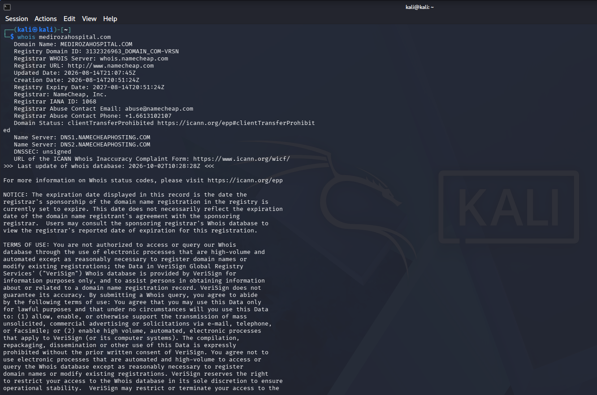

`nslookup` resolved the apex domain to `199.188.201.16`.

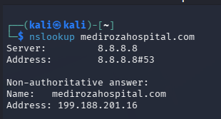

`dnsrecon` enumerated SOA, NS, MX and SPF/DMARC records, confirming the mail setup (jellyfish.systems hosting) and that the domain uses cPanel-based autodiscover endpoints.

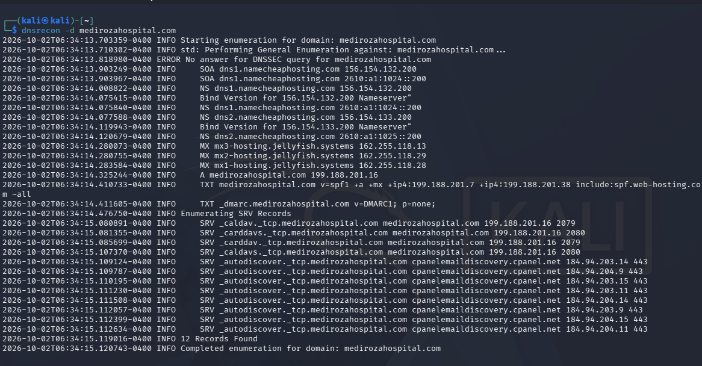

A `curl -I` request against the site fingerprinted the web server as **LiteSpeed**.

`wafw00f` confirmed the site sits behind a **LiteSpeed WAF**, which was factored into request pacing during active scanning.

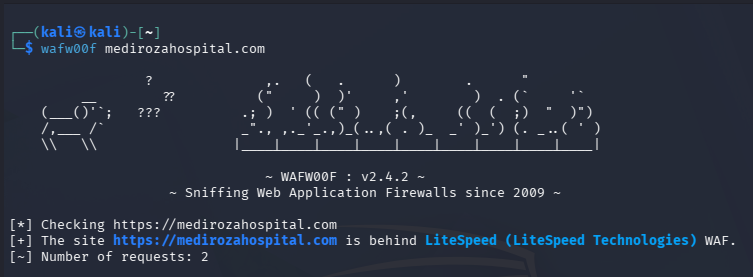

### Content Discovery

`gobuster` was run against the target using `dirb`'s common wordlist, revealing a large number of `mod_userdir`-style `~username` redirects (301) alongside several 403-protected admin/control-panel paths (`cgi-bin`, `controlpanel`, `server-status`, `webmail`). Notably, `/old/`, `/staff/`, `/robots.txt` and `/sitemap.xml` returned non-404 responses, indicating they existed but were access-restricted or worth investigating further.

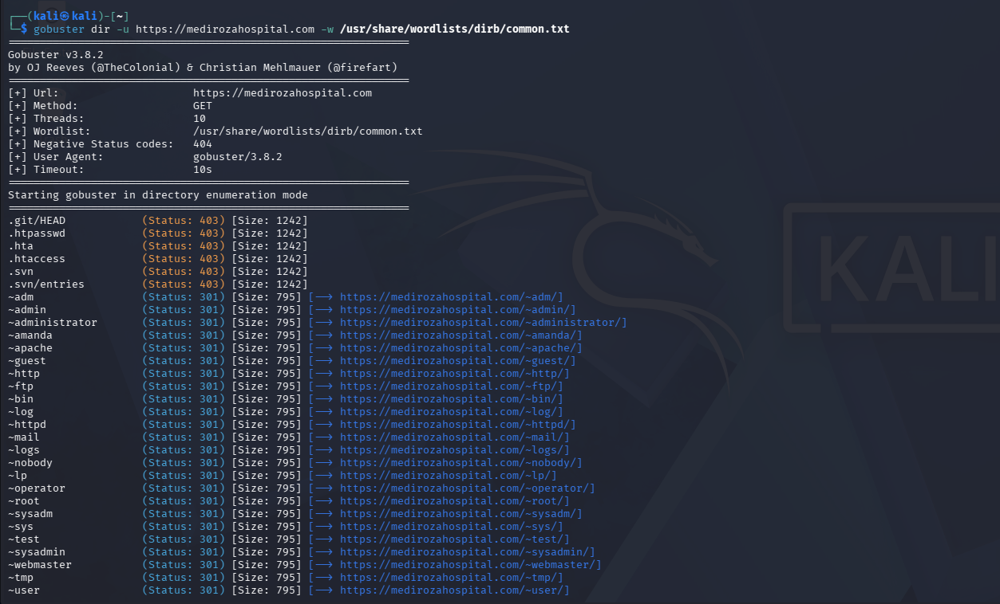
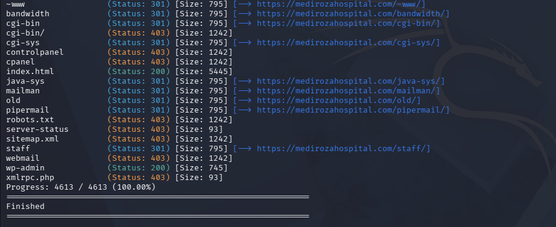

`robots.txt` itself confirmed three interesting hidden paths that the site owner explicitly tried to keep out of search engines: `/patient/`, `/staff/`, and `/old/` — effectively a roadmap to the sensitive areas of the application ("security through obscurity").

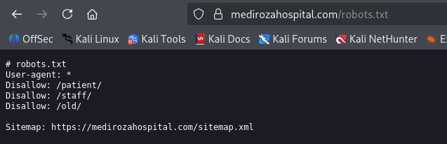

### Authentication Analysis

The Patient Portal login page (`/patient/login.php`) was tested with a non-existent username, which returned a specific **"Username not found"** error. This is a **username enumeration** vulnerability — distinguishing "wrong username" from "wrong password" responses lets an attacker build a list of valid accounts before attempting credential attacks.

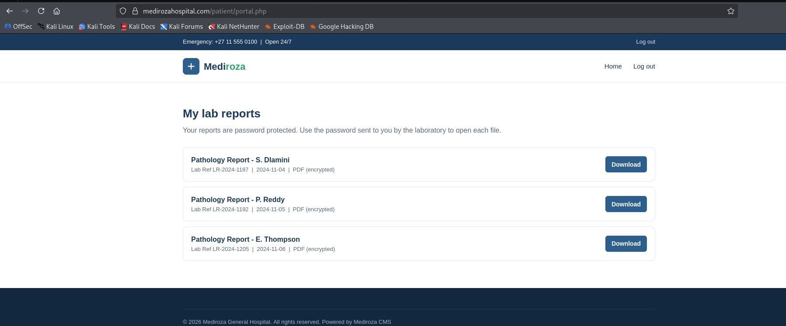
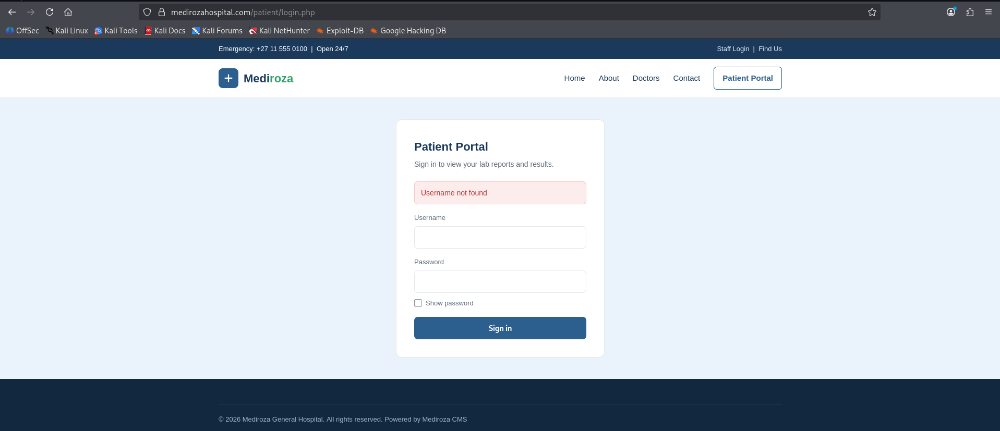

### Broken Access Control

> **Note:** confirm this matches your actual steps — adjust the wording below if you reached the portal a different way (e.g. session fixation, predictable token, IDOR on a report ID) rather than a direct unauthenticated request.

Despite the login form rejecting the test username, navigating **directly** to `medirozahospital.com/patient/portal.php` returned the fully rendered "My lab reports" page — without ever successfully authenticating. This is a **broken access control / missing authentication check** on a sensitive page: the application relies on hiding the URL (and blocking it via `robots.txt`) rather than enforcing a server-side session check.

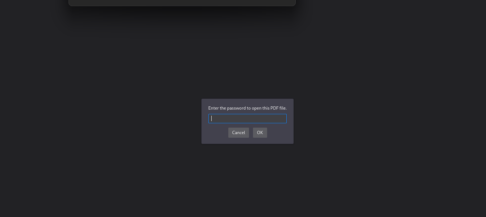

The portal listed three encrypted PDF lab reports belonging to named patients (S. Dlamini, P. Reddy, E. Thompson), each downloadable without any further authorization check.

**M1 Deliverable:** Unauthenticated access to the patient portal achieved via forced browsing to `/patient/portal.php`; three encrypted PDF lab reports retrieved (`patient_report_1.pdf`, `patient_report_2.pdf`, and a third file for E. Thompson).

---

## M2 — Data Extraction (PDF Decryption)

Each retrieved PDF was protected with 128-bit RC4/AES encryption (PDF Revision 3, Version 2). Rather than assume a single method would work, each file's hash was extracted individually and cracked independently as instructed.

### File 1 — `patient_report_1.pdf`

A `pdf2john`-compatible hash was extracted using the Networkwalks Hash Calculator tool:

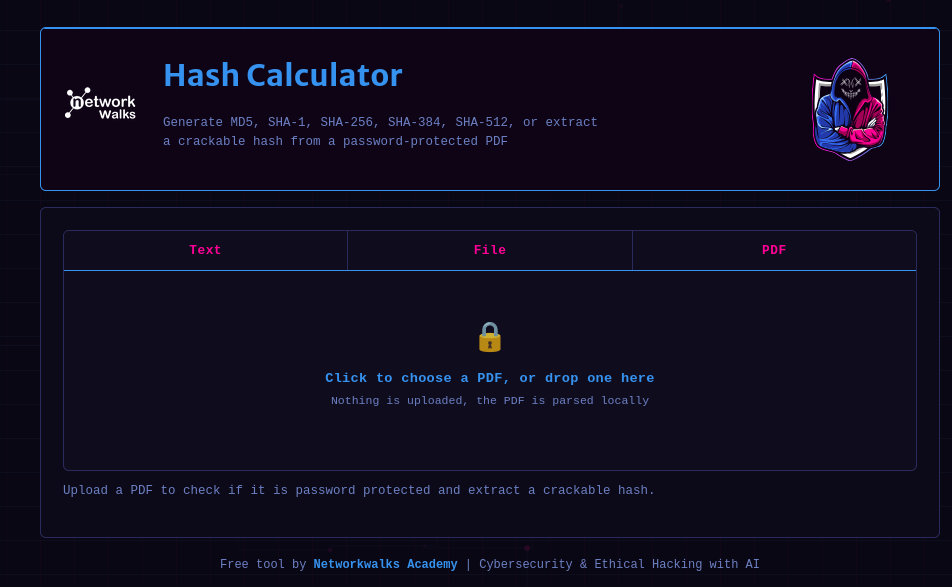
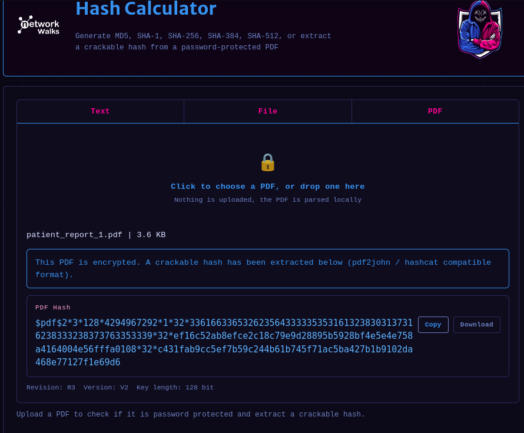

A dictionary attack against this hash cracked the password on the first attempt:

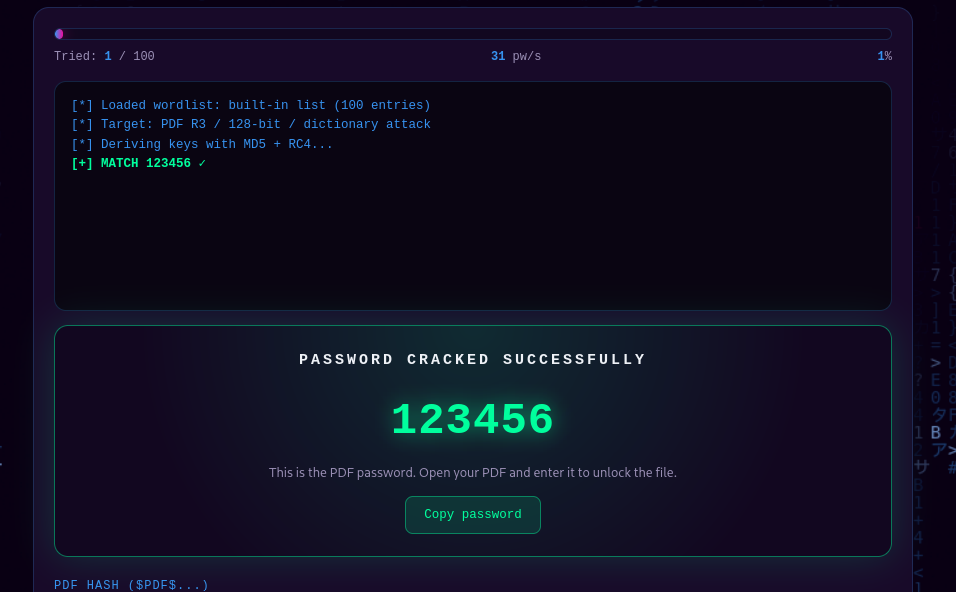

**Recovered password:** `123456`

Using this password, the file opened to reveal the pathology report for **Sipho Dlamini** (Patient ID `MG-P-10231`, Lab Ref `LR-2024-1187`) — full blood count results including haemoglobin, white cell count, platelets, glucose and creatinine.

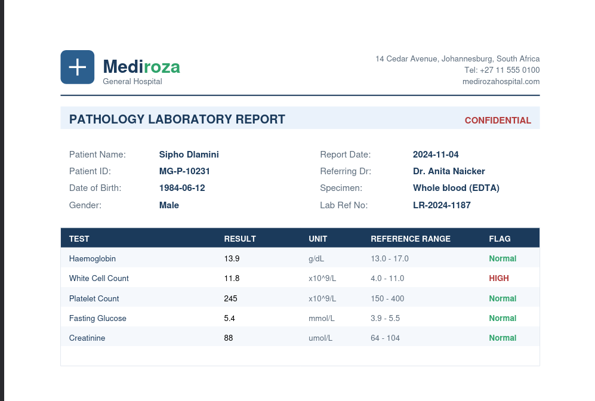

### File 2 — `patient_report_2.pdf`

The same process was repeated for the second file. Its hash was extracted:

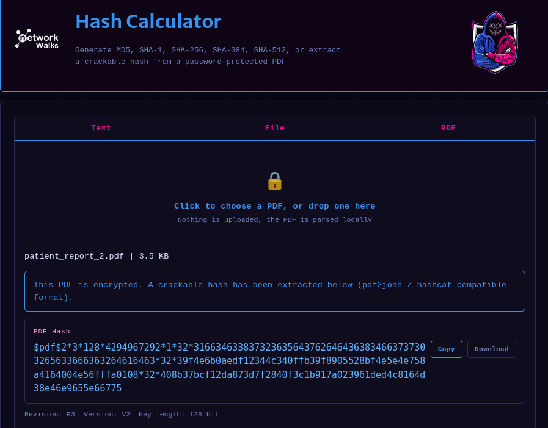

This file used a different, equally weak password, confirming the hint that a single approach would not work for all three files:

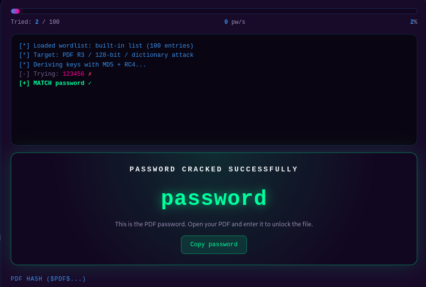

**Recovered password:** `password`

Unlocked contents — pathology (lipid profile) report for **Priya Reddy** (Patient ID `MG-P-10244`, Lab Ref `LR-2024-1192`):

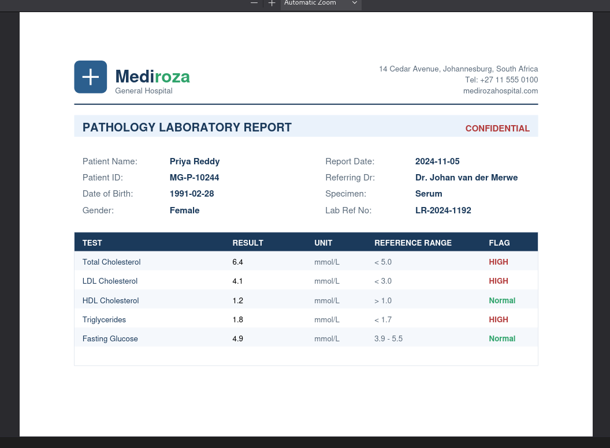

### File 3 — `patient_report_3.pdf`

This file's hash was uploaded to the cracking tool in the same way:

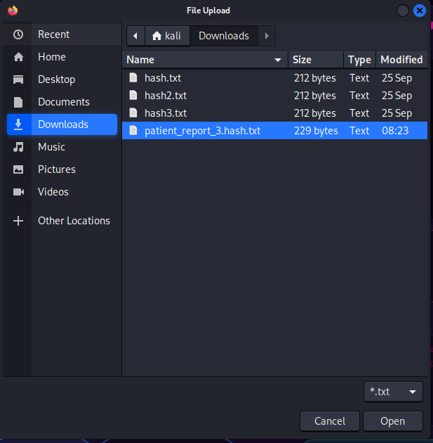
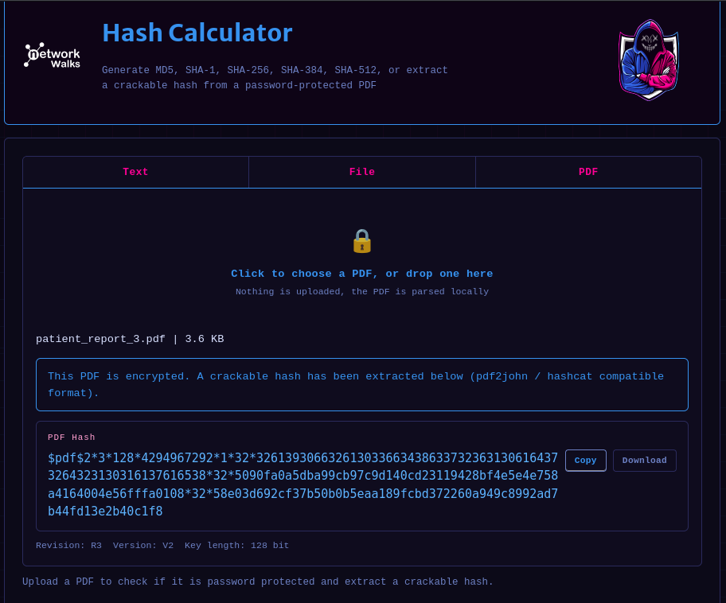

The built-in 100-word list was exhausted with **no match**, confirming the earlier hint not to assume a single wordlist/approach would work for every file:

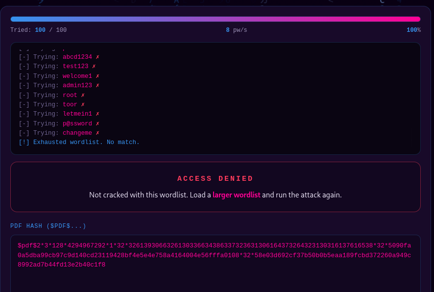

Re-running the attack against a larger wordlist (3,556 entries) successfully cracked the password:

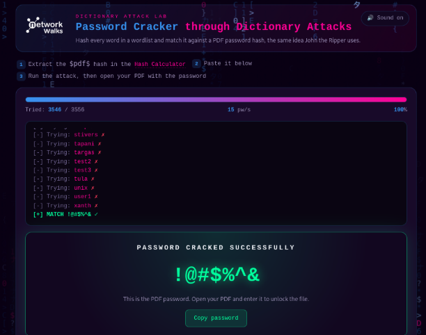

**Recovered password:** `!@#$%^&` — a symbol-only password that defeated the small default list but fell to a slightly larger dictionary, underscoring that "complex-looking" passwords are still weak if they're a common/reused pattern.

Unlocked contents — pathology (full blood count) report for **Emily Thompson** (Patient ID `MG-P-10258`, Lab Ref `LR-2024-1205`):

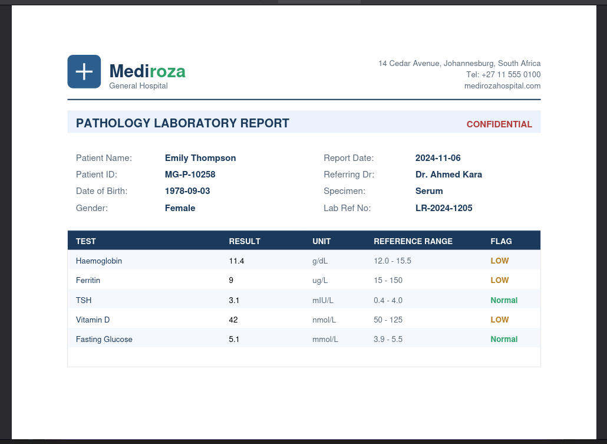

**M2 Deliverable:** All three PDF encryption passwords recovered via dictionary attack — `123456` (File 1), `password` (File 2), `!@#$%^&` (File 3). Full contents of all three lab reports confirmed accessible in plaintext.

---

## M3 — Critical Data Exposure

### The clue was in the metadata

As hinted ("look beyond the obvious content — examine all file properties carefully"), the document properties of all three PDFs were reviewed:

| File | Author | Subject | Creator |
|---|---|---|---|
| `patient_report_1.pdf` | Mediroza Diagnostics Lab | Full Blood Count | Mediroza CMS 1.4.2 |
| `patient_report_2.pdf` | Mediroza Diagnostics Lab | Lipid Profile | Mediroza CMS 1.4.2 |
| `patient_report_3.pdf` | **j.malik** | Full Blood Count | Mediroza CMS 1.4.2 |

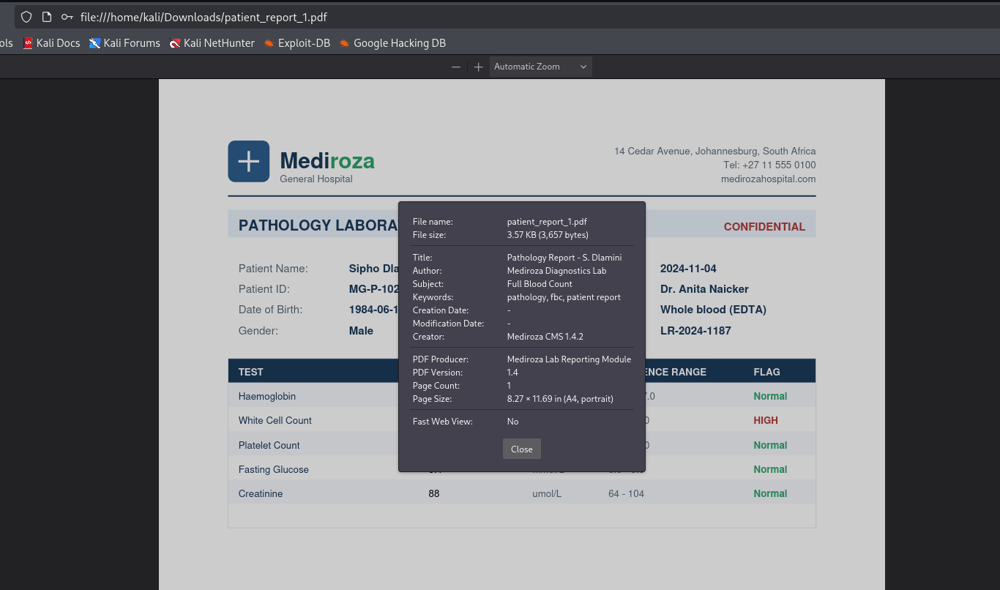
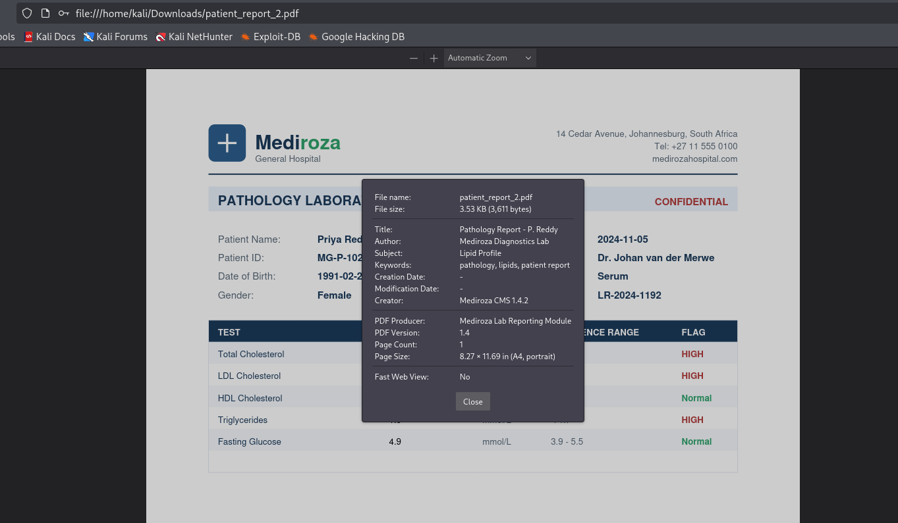
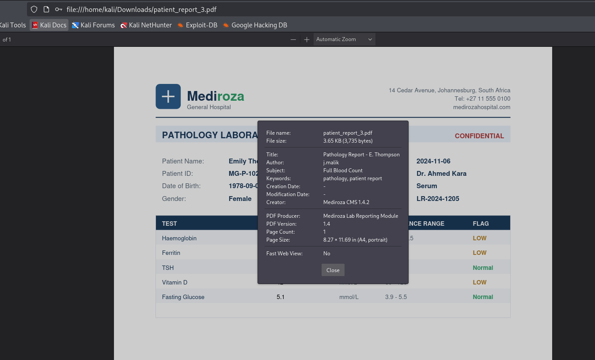

Files 1 and 2 were generated with the generic "Mediroza Diagnostics Lab" author tag, but File 3 was authored under the account **`j.malik`** — an individual username rather than the standard service account. This stood out as worth pivoting on.

### From a username to a full database backup

`j.malik` matched a username pattern already seen in the `/staff/` area implied by `robots.txt`, and combined with the earlier directory enumeration, the `/old/` path (also disallowed in `robots.txt`, also flagged as a live redirect by `gobuster`) was checked directly. Directory listing was enabled and exposed a single file: a legacy MySQL backup.

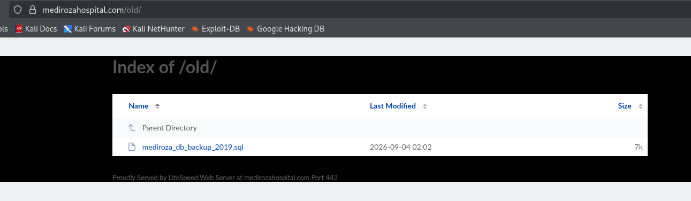

Downloading and opening `medirozahospital.com/old/mediroza_db_backup_2019.sql` revealed two full database tables dumped in plaintext SQL:

**`staff` table** — 30 rows, including every employee's full name, job title, department, work email, phone number, **national ID number**, and **monthly salary (ZAR)**. Row 9 confirms the link back to the PDF metadata clue: `Jameel Malik`, **IT Systems Administrator**, IT department — i.e. the account whose name appeared as the "author" of File 3's PDF.

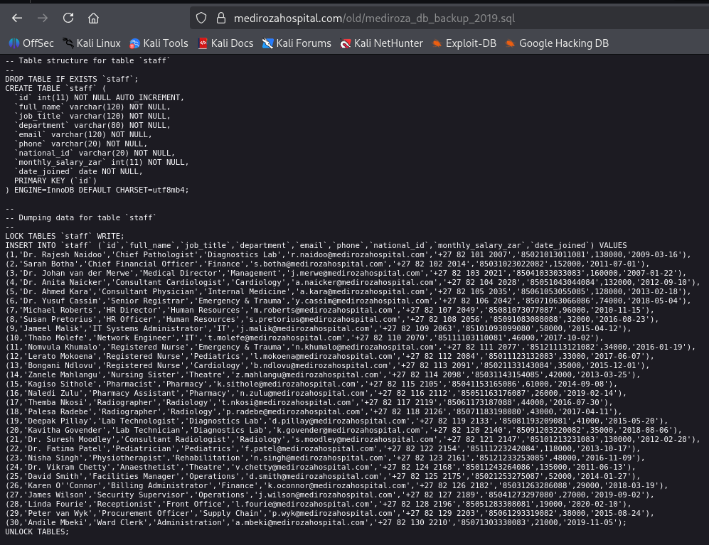

**`shareholders` table** — 10 rows, listing each shareholder's name, shareholding percentage, number of shares held, and share class:

| Shareholder | Share % | Shares Held | Class |
|---|---|---|---|
| Dr. Rajesh Naidoo | 18.0% | 180,000 | Ordinary |
| Cedar Health Holdings (Pty) Ltd | 15.0% | 150,000 | Ordinary |
| Dr. Johan van der Merwe | 12.0% | 120,000 | Ordinary |
| Reddy Family Trust | 11.0% | 110,000 | Ordinary |
| Thabo Molefe | 10.0% | 100,000 | Ordinary |
| Sarah Botha | 9.0% | 90,000 | Ordinary |
| Dr. Ahmed Kara | 8.0% | 80,000 | Preferential |
| Naledi Zulu | 7.0% | 70,000 | Ordinary |
| Michael Roberts | 6.0% | 60,000 | Ordinary |
| Dr. Vikram Chetty | 4.0% | 40,000 | Preferential |

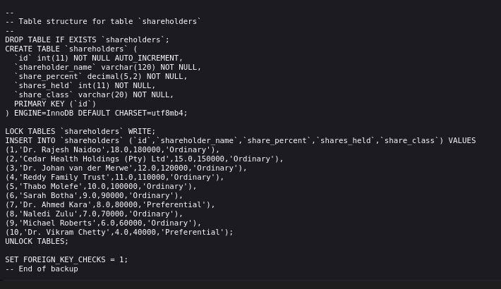

Full raw evidence (table structure + dumped rows) is preserved in [`evidence/mediroza_db_backup_2019.sql.md`](./evidence/mediroza_db_backup_2019.sql.md) for the record; salary figures ranged from roughly R26,000/month (Pharmacy Assistant) up to R160,000/month (Medical Director), across clinical, nursing, radiology, pharmacy, IT, finance, HR and operations staff.

**M3 Deliverable:** Full staff salary register (30 employees, including national ID numbers and compensation) and the complete shareholder/cap table (10 shareholders) recovered from an unauthenticated, indexable legacy backup file at `/old/mediroza_db_backup_2019.sql` — discoverable via the same `robots.txt` disclosure identified in M1.

---

## Findings Summary & Risk Ratings

| # | Finding | Risk | Justification |
|---|---|---|---|
| 1 | Broken access control on `/patient/portal.php` | **Critical** | Unauthenticated access to protected health information (PHI) for multiple named patients |
| 2 | Username enumeration on patient login | **Medium** | Distinct error messages allow an attacker to build a valid-account list, enabling targeted credential attacks |
| 3 | Weak PDF encryption passwords (dictionary-crackable) | **High** | Encryption is undermined by trivially guessable passwords (`123456`, `password`), exposing full lab results |
| 4 | Sensitive paths disclosed via `robots.txt` | **Low** | `/patient/`, `/staff/`, `/old/` are listed, effectively mapping sensitive areas for an attacker |
| 5 | Unauthenticated, indexable legacy backup exposing full staff PII/salaries and shareholder cap table | **Critical** | Directory listing enabled on `/old/` allowed direct download of `mediroza_db_backup_2019.sql`, exposing national ID numbers, salaries and contact details for 30 staff, plus the hospital's complete ownership structure |
| 6 | Sensitive data leakage via PDF document metadata | **Low** | PDF "Author" field on one report exposed an internal staff username (`j.malik`), aiding reconnaissance into staff systems |

## Recommendations

1. **Enforce server-side session/authorization checks** on every patient-facing page — do not rely on obscurity or `robots.txt` to protect sensitive endpoints.
2. **Standardize authentication error messages** (e.g. "Invalid username or password") to prevent username enumeration.
3. **Enforce a strong password policy** for any document encryption or portal credentials — minimum length/complexity, reject common passwords (e.g. via a breached-password check).
4. **Remove sensitive paths from `robots.txt`**; rely on authentication, not disallow rules, to keep private areas private.
5. **Disable directory listing** on all web-accessible paths, and remove legacy/backup files (e.g. `/old/`) from production web roots entirely — backups belong in secure, non-web-accessible storage.
6. **Rotate all exposed credentials and re-issue national ID-linked records** affected by the `mediroza_db_backup_2019.sql` exposure, and notify affected staff and shareholders per applicable data-breach regulations (e.g. POPIA in South Africa).
7. **Strip or sanitize document metadata** (author, creator, internal usernames) before publishing or linking any client-facing document.
8. **Conduct periodic access-control and authentication testing** as part of ongoing security hygiene, particularly for any portal handling PHI or financial records.

---

*This report was produced as part of a Networkwalks Academy training exercise in a controlled environment. All testing was authorized in writing and limited to the agreed scope.*
